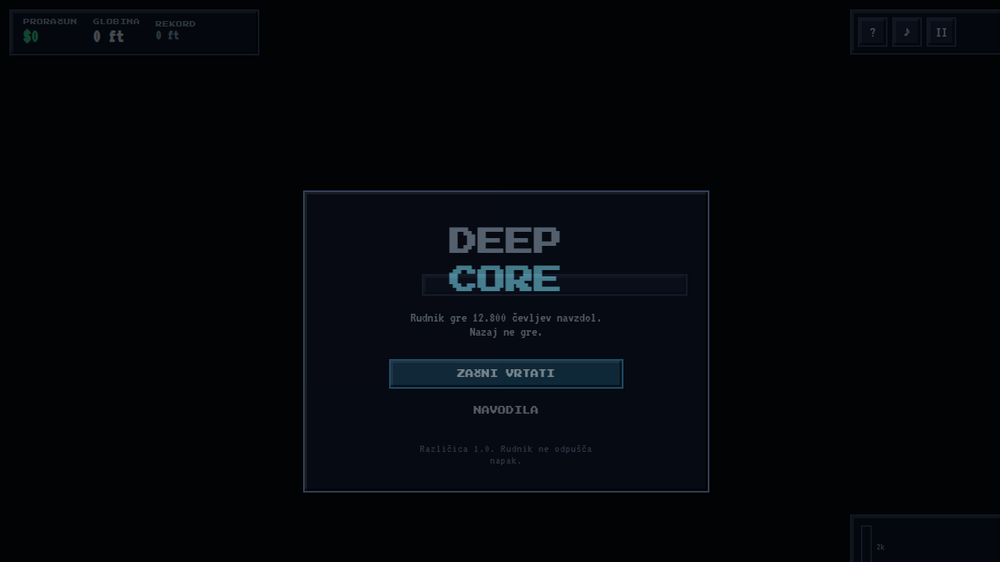
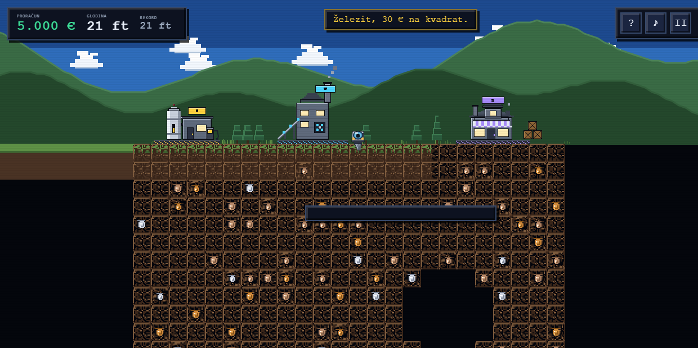

# Deepcore

**Deepcore** - a browser remake of **Motherload**: drill into a procedurally
generated mine, haul the ore home, upgrade the pod, and find out what is at the
bottom.

Drill into a procedurally generated mine, haul the ore home, upgrade the pod, and
find out what is at the bottom. The game is **in Slovenian and priced in euros**.

Plain HTML, CSS and JavaScript. **No dependencies. No build step. No bundler.**





```bash
npm start          # http://127.0.0.1:8765
```

**Play it:** <https://ribaumorju.github.io/motherload2026/>

Any static host will do; there is nothing to compile. The only reason a local
server is needed at all is that ES modules do not load over `file://`.

> **Fan project.** Not affiliated with, endorsed by, or connected to XGen Studios.
> Motherload is their game; this is an unaffiliated tribute reimplementation
> written from scratch. All code here is original.

---

## The easter eggs

The game is its own thing again - a mine, not a government department. The jokes
that survive are the ones the *mine* would tell:

- **The deep ores have something to say** when you find one - keyed by ore, so a
  second ruby gets the line you remember rather than a reroll.
- **The facilities keep office hours**, printed in the dock prompt.
- **The bottom of the mine** is where the joke pays off.

None of it changes the game. The text lives in `src/teksti.js`, so there is one
file to open to add a gag and no risk of one landing in the sim.

### Language and money

The interface is Slovenian. The **identifiers are not**: `ironium`, `drill`,
`out of fuel` are save keys and lookup keys, and translating them would break
every existing save and every test that names one, while buying nothing - no
player ever reads a key. Only display text is translated.

Money is euros, grouped the Slovenian way (`12.800 €`) by a hand-rolled formatter
rather than `toLocaleString('sl-SI')`, because the browser and Node do not always
agree on locale data and the tests assert on the exact string.

The pixel fonts were checked before they were relied on. Both Press Start 2P and
VT323 declare a `latin-ext` face covering `U+0100-02BA`, so **č, š and ž render in
the font instead of falling back** to a different typeface mid-word - which is the
kind of thing that only shows up once the text is in the other language. A
browser check asserts the carons survive into the DOM as real code points rather
than as mangled bytes.

---

## The game

The loop is the original's: dig down, come back up, sell, upgrade, go deeper.

- **12,800 feet** of mine, generated from a seed, with ten ores unlocking as you
  descend and three things that want to kill you.
- **Six upgrade ladders** - drill, hull, engine, radiator, fuel tank, cargo bay -
  seven tiers each.
- **Kilograms, not tiles.** The hold is measured by weight, so the heavy cheap
  ore near the surface fills it in a handful of tiles while a ruby barely
  registers. That one choice is what makes the early game about volume and the
  late game about surviving long enough to carry the find home.
- **The drill follows the controls.** Hold a direction and the bit cuts that
  way - sideways to chase a seam, upward to tunnel out of a cavern you fell
  into, downward to descend. Tunnelling up is slower and dearer than flying, so
  it never becomes the way home, only the way out of a trap.
- **Gas pockets** that look exactly like rock until your drill touches one.
  **Lava** that the drill will not cut and that cooks you if you get close, so
  you route around it or blast through it. **Hard landings** that cost hull.
- **Running out of fuel or wrecking the pod costs you the hold, never your
  upgrades.** Dying is a setback measured in one trip, not in the run.
- **Mr. Natas**, at the bottom, behind more rock than any sane person would dig.

Arrow keys or WASD to fly, and **pushing into rock drills it** - there is no
separate drill button, because you point the pod at the rock and it goes through
it. Hold `Space` (or `Shift` / `J`) to cut straight down on the spot without
moving. `E` docks at the surface buildings, `Esc` pauses, `M` mutes. On a phone
the left half of the screen is a stick and the right half drills.

Two rules are worth knowing before you start, because they are the ones the game
does not explain twice:

- **Lava cannot be drilled.** The drill refuses it. Explosives will clear it, so
  a pool is a detour rather than a wall.
- **Falling down your own shaft is safe.** A terminal-velocity landing costs
  about a point and a half of hull. The things that end a run are gas, lava and
  an empty tank.

### The look

It is deliberately 1999. Flat pixel art with hard edges, a limited palette, pixel
fonts, solid panels with two-pixel borders and bevelled edges, and hard offset
shadows. Nothing on the screen is blurred, rounded or faded: no gradients, no
bloom, no glow, no translucency, and no fog hiding the mine.

**The rock has a shape, not just a colour.** Every tile is a chipped block inside
its cell - full width, with the corners cut by a depth that comes from the tile's
variant - and then speckled, veined and pebbled on a 16x16 pixel grid. All of it
comes from one position hash, so a wall reads as stacked boulders and still looks
identical every time you fly past it. Tiles of the same depth differ from their
neighbours by about half their pixels, which is what stops a large wall from
tiling visibly.

An earlier version drew rock as three tones in 6px blocks, so a 32px tile was
five blocks across and a wall of rock was a five-by-five mosaic that read as flat
mush. No amount of extra colour fixed that; the blocks were simply too big to
carry a texture.

**The surface is a place you came from.** Blue daytime sky with drifting clouds,
a lit ridge on the hills, a treeline behind the buildings and grass breaking the
horizon. The sky used to run from near-black to rust, which made the surface the
darkest thing in the game and the deep rock comparatively bright - backwards, for
a game whose whole subject is going down.

**The three buildings have three silhouettes.** They used to be one grey box drawn
three times with a different coloured strip, which is why the surface looked
empty: there was nothing to look at, and nothing to tell them apart until you
were close enough to read the strip. Now the depot is a squat hut beside a tall
tank with a pump and a hose; the processor is a tower with a chimney, a conveyor
feeding it and an auger that turns; the store is wide and low under a striped
awning with crates outside. You can name each one from across the mine, and the
colour only confirms what the outline already told you. There is no text on any
of them - a sign in a webfont is a sign that might not have loaded.

The crack overlay, the gas seams and the lava crust are all stepped out pixel by
pixel rather than stroked with canvas lines, because a stroked line is
anti-aliased and puts grey half-pixels into a scene that is otherwise exact
colours. The browser checks assert on that.

---

## Layout

```
index.html            the shell: a canvas and a div for the HUD
styles/game.css       the whole interface
src/
  config.js           every tunable number in the game, in one file
  audio.js            procedural sound; there are no audio files
  input.js            keyboard, pointer and touch, reduced to one object
  hud.js              the DOM overlay: meters, depth gauge, radar, toasts
  menus.js            title, help, pause, shop, end screen
  main.js             the loop, and the wiring between sim and screen
  sim/                the game itself - no DOM, no canvas, runs in Node
    rng.js            seeded randomness
    world.js          the mine: tile storage, generation, carving
    physics.js        collision and movement helpers
    game.js           state, step(), digging, economy, hazards
    save.js           save and load
  render/             everything that turns state into pixels
    camera.js         follow, lead and shake
    palette.js        the colour of depth
    atlas.js          every tile sprite, drawn once at startup
    buildings.js      the three surface buildings
    world.js          sky, ground, tiles, Mr. Natas
    ship.js           the pod
    fx.js             particles, floating text, vignette, CRT
tests/selftest.mjs    the sim's own test suite, in Node
tools/                dev server, test runners, screenshot sheet
```

### Why it is split this way

**The simulation does not know the browser exists.** `sim/` imports nothing from
`render/`, never touches `document`, and never reads a key. It takes
`step(state, dt, input)` and writes what happened into `state.events`; `main.js`
drains those events and turns them into sound and toasts.

That is not architecture for its own sake. It means the entire game - movement,
digging, economy, hazards, the save file - is testable in Node in a few
milliseconds, with no headless browser and no mocking. `tests/selftest.mjs` runs
five simulated minutes of mining and trading and asserts the run stays
consistent. None of that would be possible if the sim could reach the DOM.

**The sim runs on a fixed timestep, the renderer on the real one.** Physics that
varies with frame rate is physics that behaves differently on a laptop and a
phone, and the drill is a rate over time - the one thing that must not vary.

**The HUD is DOM, not canvas.** It is text and bars that have to stay crisp at
any pixel ratio, respond to hover, and be readable by a screen reader. Canvas is
the wrong tool for all three. The only canvas in the interface is the depth
gauge, which is genuinely a picture.

---

## Verifying it

```bash
npm test           # everything: syntax, sim, then the real browser
npm run test:sim   # the sim alone, in Node - fast
npm run shots      # render the visual sheet to tools/shots/sheet.png
npm run fuel       # can a tank reach the bottom and get home?
npm run balance    # play 30 simulated minutes with a bot and report
```

`npm test` runs three layers:

1. **Syntax** - every module parses.
2. **Sim** (77 checks) - generation is deterministic per seed, the sky is never
   breached, the pod never ends up inside rock, ore respects its depth gate,
   gas detonates, lava burns and refuses the drill, explosives clear it anyway,
   pushing into rock drills it without a drill button, a held direction in open
   air does not cut a tile far below the pod, a pod resting on a ledge can still
   get down, money formats as grouped euros, no player-facing string is blank or
   still in dollars, no shipped file still carries the old branding, the economy
   never overdraws, every event the sim emits is handled, the save round-trips,
   and five simulated minutes of play stay consistent.
3. **Browser** (53 checks) - the real page in headless Chrome: every module
   imports, the atlas builds, real frames draw into a real canvas, the HUD
   mounts, every menu opens, every sound cue plays, the rock sprites carry texture
   and no anti-aliasing, the three buildings have three different outlines, the
   title screen carries no branding, and a save survives a real `localStorage`
   round trip. A second pass boots the real `src/main.js` and drives its loop,
   because a test of the parts says nothing about the wiring.

The browser layer also samples **actual pixels**, because the things that break
silently in a renderer are visual and no assertion about state catches them: the
view has to be lit edge to edge at depth, the rock has to get darker with depth,
the palette has to interpolate, ore has to be brighter than the rock around it,
the sky has to be flat bands rather than a gradient, the bit has to end up
pointing at the rock it is cutting, and the frame must not be blank.

`npm run shots` writes a sheet rendering the game at six depths, which is how
the look gets reviewed without playing to 9,000 feet.

### The two tools that are not tests

`npm run fuel` answers the single most important number in the game - can a full
tank dig a hole and get home again - for every tank tier. It is not obvious from
the config, and a tank that cannot pay for a round trip makes the first minute
unwinnable while looking like a difficulty problem.

`npm run balance` plays the game with a bot and reports what happened: trips,
earnings, how far it got, where its time went, and the cause of every wreck. The
bot digs straight down and dodges lava by looking one square ahead, which is a
much worse miner than a person with a radar and a hull bar. Its results are
therefore a *lower* bound, and its wrecks are not treated as a balance failure -
tuning the hazards until a blind digger survives them would be the opposite of
what makes them hazards. What it is good for is the shape of the run, and it
found most of the real bugs in this project.

Two things it is not good for. It is **fuel-limited, not depth-limited**: with a
mid-tier tank it fills about 40% of its hold before the low-fuel warning sends it
home, which is the game working as designed rather than a grind. And because a
held direction now drills, its crude navigation cuts into walls - steering while
climbing means drilling sideways out of its own tunnel - so its numbers are worse
than they were before that change, while a person flying straight up a shaft they
dug is unaffected. When it reports the economy as too tight, check `npm run fuel`
and play for a minute before believing it.

---

## Notes on the implementation

**The mine is stored in flat typed arrays.** A `Uint8Array` for the tile kind and
variant, a second for ore ids, a `Float32Array` for drill progress. Only the
tiles on screen are drawn, which is what keeps a 400-row mine at a steady frame
rate. Ore ids live in their own array because packing them into the same byte
worked right up until the tenth ore arrived and there was no room left.

**The drill does not cut a square until that square is gone.** An earlier version
pushed the pod into the tile while it was still cutting, so the target advanced
before the current square was finished, the drill spread its damage across a run
of half-cut tiles and finished almost none of them. It looked like a very slow
drill rather than a bug, and it took a bot playing for thirty minutes to make it
visible.

**The pod is 26px wide in a 32px tunnel, so the drill steers it.** Left alone it
drifts until its hull straddles two columns, and then the one-tile tunnel it just
dug is too narrow for it to enter. The bit centring the pod reads as the drill
steering the ship, which is also what it is.

**The tiles are pre-rendered.** Every rock, ore, gas and lava sprite is drawn
once at startup at 2x and blitted. Per-pixel noise per tile per frame is a way to
spend an entire frame on the background.

**A tile is a boulder, not a square.** The sprite is clipped by cutting its corners
by a per-variant amount and then bevelling only the flat top and left - an earlier
version bewelled the full cell, which drew a lit border around the cut corners and
put back exactly the square grid the chips were there to break up. The chips are
what makes a wall of rock read as stacked boulders.

**Nothing in the tile art is anti-aliased.** Cracks are stepped out one pixel at a
time rather than stroked, because a canvas stroke lands grey half-pixels in a
scene that is otherwise exact colours - visible the moment it sits next to rock.
The browser suite counts semi-transparent pixels in the crack overlays and expects
zero.

**There is no fog of war.** The mine used to be a circle of light around the pod
with darkness everywhere else, built as a separate quarter-resolution canvas with
holes punched in it with `destination-out`. It looked good and it was the wrong
game: the original showed you the wall you were about to cut, and a player who
cannot see the rock cannot plan a route through it. What tells you how deep you
are now is the rock's own colour, which was doing most of that work anyway.

**The drill is aimed; only its flutes turn.** The bit is drawn pointing at the
tile it is cutting - down, sideways or up - and the spin only slides the flutes
across it. Rotating the whole cone by the spin angle, which is what it did first,
makes the bit sweep through every orientation like a clock hand and spend most of
its time pointing at nothing.

**Holding a direction drills it.** There is no separate drill button: pushing
into rock cuts it, which is what the original did and what makes the controls one
idea instead of two. The search for what to cut only looks a couple of rows past
the hull, because it has to be bounded - an unbounded one means holding Down while
falling down an open shaft quietly bores a hole hundreds of feet below the pod.

**A pod resting on a ledge used to be stuck there for good.** The hull is 26px
wide in a 32px tile, so a pod a few pixels off centre is held up by the
*neighbouring* column's rock while its own column is clear all the way down:
there is nothing to cut and nothing to fall through, so holding the drill did
nothing at all. The drill now centres the pod on its own column when it is aimed
down at open air and sitting still, which slides it off the ledge. The bot found
this by not moving for twenty seconds and reporting the column underneath as
`empty, empty, empty, empty, empty, empty, empty`, which is the entire diagnosis.

**Flying over the surface used to drill it.** When the drill found nothing solid
within reach it named a real row rather than an empty one, and the nearest real
row above the sky is the ground - so a pod climbing out of the mine quietly
chewed a hole in the landing strip, and the drill's extra drag made the climb home
look sluggish. Naming an empty tile instead means the drill simply does nothing.

**Saving is a seed and a list of holes.** The terrain is fully determined by its
seed, so the only thing worth storing is what the player changed. A deep run
saves in a few kilobytes.

**Sound is synthesised.** No audio files, so nothing to download and nothing to
licence - and the drill can be a continuous voice whose pitch tracks how hard
the rock is, rather than a sample that has to be crossfaded.

**The depth palette interpolates between eight bands** rather than switching at
depths, because a hard colour change reads as a rendering bug. The rock goes
warm brown, grey, cold slate, near-black purple, and finally black lit from
within by red.

**The buildings live in their own module.** They share one pixel-grid primitive
and one palette, but each is a single function drawing a single silhouette - so
redrawing the depot cannot break the store, and the whole surface is three calls.
`world.js` keeps the ground they stand on.

**Only the buildings' colour comes from config.** `FACILITIES` carries the accent
colour, the name and the docking note; the shape lives in `buildings.js`, keyed by
the same `key` the sim uses for docking. A new building needs a `key`, an entry in
the facility table, and a function here.

### Deliberate simplifications

- The mine is one screen wide. The original scrolled horizontally too; a single
  column makes the depth gauge honest and the trip home a real decision.
- There is no shop restocking, no day cycle, and no random events. The pressure
  comes from fuel, hull and depth.
- The engine's effect on speed is smaller than the original's, because the
  original's top tier outran the frame rate rather than the player.
- The pod can dig upward, which the original did not allow. Without it, a pod
  that falls into one of the mine's enclosed caverns can never get out, and the
  only escape is to be wrecked on purpose.
- Distances are still in feet, not metres. The mine's balance - the depth gates,
  where the hazards start, the eight palette bands, the fuel model - is expressed
  in feet throughout, and switching the unit means re-deriving all of it rather
  than relabelling it. Everything else is metric already, because it always was:
  the tank is litres, the hold is kilograms, the drill is feet per second.

---

## Credits

Motherload was made by **XGen Studios** in 2004. This is an unaffiliated tribute
built from scratch: no original assets, code or data are used. Ore values, tier
prices and tier names follow the original's tables so the progression feels
familiar; everything else - the generation, the physics, the rendering, the
audio - is new.
